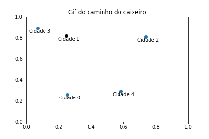

# Experimentos de otimização e algoritmos genéticos
Olá, leitor! Nessa pasta, você encontra todos os experimentos realizados por mim, Isabela Beneti, na disciplina de Redes Neurais e Algorítmos Genéticos (RNAG). Para saber mais sobre eles, você pode acessar os notebooks, ou clicar nos subtópicos abaixo:

<b>Experimento A0.1</b>

O primeiro experimento, resolvido no notebook "experimento A.01" foi resolvido em classe utilizando python puro, isto é, apenas python e as bibliotecas já embutidas no JupyterNotebook. Nele, nós resolvemos o problema de **4 caixas binárias** utilizando o método de **busca aleatória**. Para tanto, escrevemos 3 funções que, ao final, devolviam uma resposta diferente a cada vez que rodávamos a célula

Logo, concluímos que o método de busca aleatória é **probabilístico**, e não determinístico.

  
ATUALIZAÇÃO 16/03: ao invés de definirmos as funções nesse notebook, transferimo-nas para o arquivo "funcoes.py" e importamo-nas
  

<b>Experimento A0.2</b>

No segundo experimento,  resolvemos o problema de **caixas binárias** utilizando o método de **busca em grade**. Para tanto, importamos uma função entre as funções escritas no experimento A.01. A partir desse método, conseguimos analisar todas os indivíduos (candidatos) possíveis, e, por isso, o código sempre nos retornava a mesma resposta.

Logo, concluímos que o método de busca em grade **determinístico**, e não probabilístico .

<b>Experimento A0.3</b>

Na segunda aula de Redes Neurais e Algorítmos genéticos, desenvolvemos o nosso primeiro **algorítmo genético**, com o intuito de resolver o nosso problema das **caixas binárias**, seguindo o mesmo modelo dos outros experimentos.

No experimento 3, concluímos que o método de algorítimos genéticos é **probabilístico**, pois depende de fatores aleatórios, incluindo constantes como a chance de mutação e de cruzamento, que, inclusive, podem determinar quão boa será a sua resposta.

<b>Experimento A0.4</b>

Na aula do dia 23/03/2023, ministrada pelo nosso querido professor e colega [João Pedro Brito](https://github.com/jpab2004), nós desenvolvemos um **algorítmo genético** para resolver o problema das caixas **NÃO binárias**. O código é muito parecido com o do experimento anterior, mudando apenas o valor dos genes que, ao invés de variarem entre 0 e 1, podem ir de 0 a 100 (incluindo 100).  Por isso, mudamos não só a função que cria genes, como também a que cria indivíduos, populações e as duas funções relacionadas a função objetivo. Tudo isso foi implementado no documento "funcoes.py".

Nesse experimento, ao mudarmos o valor das constantes de busca, ficou mais claro qual o impacto de cada uma delas na eficiência do código.

Ao aumentarmos a chance de mutação por exemplo, o código tende a dar resultados melores até um DETERMINADO PONTO, pois, se a aumentarmos demais, as mutações começarão a ser numerosas demais, resultando num código pouco eficiente. O mesmo vale para a redução excessiva dessa constante. Por isso, é bom fazer testes com esse valor para definir o melhor valor para essa constante.

No entanto, é sempre bom relembrar que esse algorítimo é **probabilístico**, e não determinístico. Por isso, mesmo mudando as constantes, nós estaremos lidando com  fatores aleatórios (de sorte)!

<b>Experimento A0.5</b>

Agora, temos um problema um pouco mais complexo, que foge do padrão das caixas binárias: precisamos descobrir uma senha, ou, pelo menos, chegar o mais próximo possível dela, sempre quantificando o quão perto um indivíduo está da resposta.  (através da função objetivo, ou fitness).

Para tanto utilizamos algoritmo genético cuja função objetivo transforma a string da senha em um vetor, e cada letra da senha corresponde a um número dentro desse vetor. Para saber quão distante um canditato está da senha que deve ser descoberta, faz-se a subtração desses vetores: quanto **menor** o valor dessa subtração, melhor o candidato! Por isso, podemos classificar esse problema como um problema de **minimização**.

Como conclusão desse experimento, pudemos perceber natureza customizável dos algoritmos genéticos. Afinal, podemos mudar várias partes do código para que ele retorne resultados melhores e mais rápido, como, por exemplo, na função de mutação, tomar em conta as distâncias entre palavras para todas as letras, e não só letra por letra. 
  

<b>Experimento A0.6</b>

A questão caixeiro viajante para um alto número de cidades é um problema para o qual não sabemos a resposta correta, pois esse é um problema NP de alta complexidade! Portanto, nesse experimento não temos critério de parada fixo. Portanto, devemos estabelecer o número de iterações como critério de parada. Afinal, o único jeito de sabermos qual o melhor caminho para o caixeiro é analisando TODAS as possibilidades. No entanto, isso é quase impossível para um número (C) muito grande de cidades, pois a quantidade de possibilidades é calculada por (C-1)! . Portanto, não é possível checar qual a melhor resposta possível do algoritmo para altos valores de C.

Outra mudança que temos nesse código é o tipo de cruzamento, visto que o cruzamento ponto simples não pode ser usado nesse problema, pois não podemos repetir cidades! Por isso, estabeleceremos dois pontos de corte distintos no cruzamento, que agora podem estar nos limites. Esses pontos estabelecerão uma região. O filho 1 vai herdar os genes entre os cortes do pai e o restante da mãe (sem repetir). O filho 2 herdará os genes entre os cortes da mãe e o restante do pai (sem repetir).

<b>Experimento A0.7</b>

Agora, retomamos um probelma que foi visto no ano passado pelos alunos da Ilum: o dos itens na mochila. Esse problema, assim como o problema do experimento anterior, é um NP difícil, o que significa que a resposta correta só pode ser obtida por meio da busca exaustiva.

O Problema da mochila (Knapsack Problem) é um problema de otimização em que se deseja determinar a melhor combinação de itens a serem colocados em uma mochila, considerando seus valores e pesos, de forma a maximizar o valor total dos itens colocados, sem exceder a capacidade da mochila.

Para resolvê-lo, foi necessário um exercício de abstração: os indivíduos do algoritmo genético desenvolvido eram listas com 0 e 1, assim como os indiívuos do problema das caixas binárias, sendo que o 1 representa que o item nessa posição está presente na mochila e o 0 representa que não está. Devido a essa semelhança com o problema das caixas binárias, foi possível utilizar as mesmas funções de gene, população, cruzamento e mutação utilizadas no experimento 3!

Como resultado, obtemos uma lista com itens que podem ser levados na mochila, mas não podemos ter **certeza** se esse resultado é o coreto ou não (apenas se o compararmos com o resultado dado por uma busca exaustiva- que, em altos valores de itens na mesa, é praticamente impossível de ser realizada).

<b>Experimento A0.8</b>

`DEAP`: módulo para programar algoritmos genéticos
Usaremos os submódulos `base, `creators` e `tools`. Além disso, importaremos o resolvedor de algoritmos genéticos `eaSimple` e a função `gene_cb`, criada por nós no primeiro algoritmo genético que desenvolvemos.

A mutação, agora, tem sua chance calculada por gene, e não mais por indivíduo. O indivíduo pode sofrer mais de uma mutação por rodada, pois agora  estamos considerando cada gene. 

<b>Experimento GA0.3</b>

Literalmente a ÚNICA diferença entre o problema do caixeiro "tradicional" é a função seleção! Afinal, no experimento A.06 do caixeiro viajante [1], nós lidamos com um problema de minimização, ou seja, procurávamos o MENOR caminho para o caixeiro percorrer. Para resolvê-lo, utilizamos a função de seleção "elecao_torneio_min".

Já no presente experimento, idamos com um problema de maximização, isto é, procuramos o MAIOR caminho para o caixeiro percorrer. Para resolvê-lo, utilizamos a função de seleção "selecao_roleta_max"!!! Além disso, fiz algumas modificações, como trocar o melhor_fitness_ja_visto inicial de float(inf) para -float(inf), e tranformar o código que achava o menor fitness em um código que acha o maior fitness.

Ao final, criei um gif que mostra o maior caminho possível para o caixeiro viajante, encontrado pelo algoritmo, para 5 cidades:

  

  

  

<b>Experimento GA0.6</b>

Esse experimento foi totalmente desenvolvido por mim, utilizando apenas algumas das funções e códigos já desenvolvidos nas aulas anteriores. Nele, escrevi um algoritmo genético que calcula o mínimo global da função de Himmelblau, uma função que possui 4 mínimos locais e que é geralmente usada como um problema de teste para algoritmos de otimização. A fórmula dessa função é dada por $f(x,y)= (x² + y - 11)² + (x+ y²- 7)²$ e seu gráfico, em 3 dimensões, é:

Para resolver esse problema por meio de algoritmos genéticos, é necessário pensar o que eu devo considerar como: Gene, Indivíduo, Função objetivo, Seleção, Mutação, Cruzamento e Critério de Parada.

Os `genes` serão valores de x e de y em um determinado intervalo de números. Logo, cada `ìndivíduo` é uma lista que contem apenas dois genes, cada um representando uma coordenada do ponto. O intervalo em que as coordenadas devem estar pode variar, mas, sabendo que os pontos mínimos de Himmelblau são (3, 2), (-2.805118, 3.131312), (-3.779310, -3.283186) e (3.584428, -1.848126) [1], é bom estabelecermos um domínio que não vá muito abaixo de -4 nem muito acima de 4, visto que nenhum mínimo será encontrado fora desses limites.

O que buscamos, nesse problema, é o ponto de menor valor da função em um determinado intervalo. Logo, a `função objetivo` deve retornar a projeção de cada ponto (indivíduo) na função $f(x,y)= (x² + y - 11)² + (x+ y²- 7)²$. Por fim, como é uma função de minimização, utilizaremos a mesma `seleção` utilizada no experimento 0.6 das senhas, assim como as mesmas funções de `mutação` e de `cruzamento`.

Por fim, o `critério de parada` pode ser simplesmente o número de gerações que estabelecemos como constante de busca, assim como estabelecemos em experimentos passados. No entanto, sabendo que o mínimo dessa função é 0, estabelecerei o critério como o "erro" máximo a ser aceito pelo código. Ou seja, se a resposta encontrada se aproximar o suficiente de 0, o código já poderá parar de rodar.

Como resultado, consegui escrever um algoritmo genético que retornava soluções muito próximas dos 4 mínimos reais da função de Himmelblau, que são  (3, 2), (-2.805118, 3.131312), (-3.779310, -3.283186) e (3.584428, -1.848126). A imagem abaixo mostra as respostas obtidas rodando o código 40 vezes, e que coincidem exatamente com os pontos de mínimo reais.

<b>funcoes.py</b>

  

Nesse documento, armazenamos funções criandas nos notebooks, o que diminui o risco de perdê-las e facilita o nosso acesso a elas. Dessa forma, criamos a nossa própria biblioteca de funções! As funções estão divididas em "setores", que dizem respeito a em qual experimento ela foi inicialmente desenvolvida.

