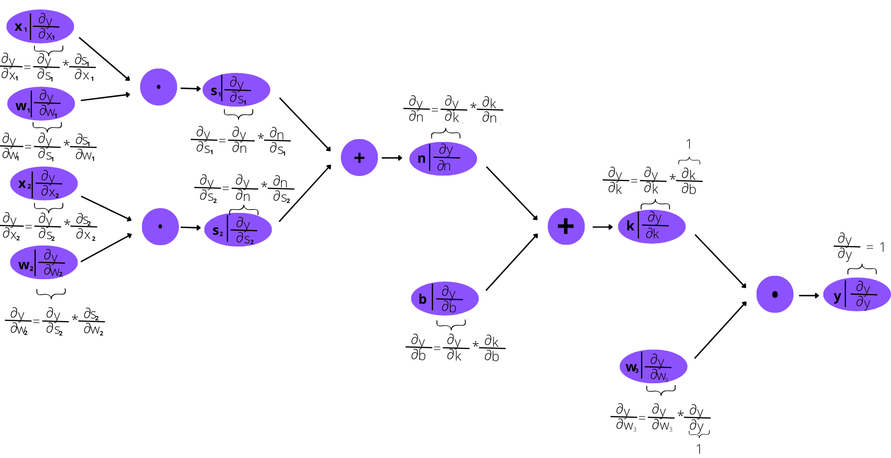

# Experimentos de otimização e redes neurais
Olá, leitor! Nessa pasta, você encontra todos os experimentos de redes neurais realizados por mim, Isabela Beneti, na disciplina de Redes Neurais e Algorítmos Genéticos (RNAG). Para saber mais sobre eles, você pode acessar os notebooks, ou clicar nos subtópicos abaixo:

<b>Primeira aula: Conceitos Básicos</b>

Pelas palavras do professor, essa foi a aula mais importante de todo o nosso ano na disciplina de Redes Neuras e Algoritmos Genéticos!

Nela, nós aprendemos que, assim como algoritmos genéticos, são códigos inspirados em biologia, mais especificamente no funcionamento de neurônios biológicos. Os principais conceitos inspirados no funcionamento dos neurônios são os de:

* Conexão
* Passagem de sinal
* Função de Ativação

Podemos representar o esquema de uma rede neural simples pelo grafo abaixo:

  

  

No grafo, os círculos com x são neurônios artificiais de input (ou de saída)), o círculo com y é o neurônio artificial de output(ou de saída), o círculo central é o neurônio artificial da camada oculta e as setas são sinapses artificiais.

As informações caminham nas sinapses artificiais, e toda sinapse tem um peso, que será multiplicado com o valor do input. Se o valor de input é $U$ , a informação transportada será $U*w_1$.

No neurônio central, temos um valor inerente $b$ (bias, ou viés) e uma função $g(x)$. A informação que ele recebe é a de $U * w_1 + T* w_2$ à qual ele soma com o valor b. Portanto, o que esse neurônio retorna é $g(U* w_1 + T* w_2+ b)$.

Logo, o neurônio de saída ($y$) receberá o valor de $g(U* w_1 + T* w_2+ b) * w_3$

## Backpropagation

Qualquer função pode ser representada por grafos! Por exemplo, as expressões $c= a + b$ e $e= c * d$ podem ser representadas por meio do grafo da figura 2:

Logo, podemos também representar a nossa rede neural simples, da figura 2, utilizando o grafo da figura 3:

  

  

A grande sacada das redes neurais foi feita pelo austríaco Linnainmaa: utilizar derivadas para sabermos o quanto cada parâmetro influencia no resultado! Afinal, a derivada mostra a variação, isto é , mostra o quanto a função está mudando em uma determinada direção. Logo, utilizando derivadas parciais, é possível descobrir o quanto y varia quando mudamos os parâmetros  $w_3$, $w_1$, $w_2$, $b$...

Se sabemos o quanto y varia conforme eu vario cada um desses parâmetros, eu podemos o quanto eu devo mudar esses parâmetros para chegar ao valor ideal de y. Essas derivadas parciais são chamadas de `Gradientes Locais do Parâmetro`. As primeiras derivadas parciais (mais próximas de y) podem ser calculadas de maneira mais direta. Conforme vamos retrocedendo nos parâmetros, é necessário ir aplicando a `regra da cadeia` para calcular a derivada, assim como mostra a figura 4:

  

  

Esse o método de ir calculando as derivadas de frente para trás é chamado de `backpropagation`. Isso é a base para vários modelos muuuito importantes, como o nosso querido ChatGPT! 

<b>Experimento R.01</b>

Esse experimento não foi feito em classe. Ele é apenas uma atividade introdutória que retoma os conceitos de derivada, que serão importantes no calculo do gradiente local das redes neurais. 
Nele, nós apenas desenvolvemos uma função que calcula a derivada de uma função qualquer e mostramos sua representação geométrica.

<b>Experimento R.02</b>

Nesse experimento, fomos introduzidos à estrutura de classes em Python, que junta ação e informação. Ela é uma estrutura de dados muito poderosa, mas também muito complexa também.

Funções definidas dentro de classes são chamadas de `método`. O que não é função dentro da classe é chamada de `propriedade`. Para chamar o método, basta colocar um ponto final e o nome do método.
  
Como conclusão desse experimento, podemos afirmar que as `classes` são, de fato, estruturas muito poderosas, mas, por conseguinte, muito complexas também.

Através desse estrutura é possível não apenas definir valores, por meio das chamadas `propriedades`, como também realizar ações, por intermédio dos `métodos` (funções definidas dentro das classes). Esses métodos podem ser `dunder` (como `__init__` e `__repr__`) ou não!

Por serem tão poderosas, as classes nos ajudarão muito a desenvolvermos nossas redes neurais, ou, pelo menos, nossas representações de redes neurais, que é o que faremos no próximo experimento, por meio de grafos.

<b>Experimento R.03</b>

Como foi antecipado no último experimento, as `classes` de fato nos ajudaram a representar redes neurais por maio de grafos.

No primeiro experimento de Redes Neurais, nós desenhamos à mão o `backpropagation` de uma rede neural, o que demorou muito tempo. Já nesse experimento, fica muito mais rápido criarmos grafos, embora eles ainda estejam incompletos. Afinal, esses grafos contem apenas o valor de cada neurônio artificial e indica quais são seus "progenitores".  Um exemplo de grafo plotado pelo código é a figura abaixo. Falta, ainda, o mais importante: o `Gradiente Local do Parâmetro`. Para calculá-lo, será necessário definir o conceito de derivadas e derivadas parciais, o que faremos nos experimentos seguintes!

<b>Experimento R.04</b>

Nessa aula, basicamente usamos a estrutura de classes para elaborar um código que realiza o backpropagation automaticamente, e, para melhor visualização do que ocorre no código, plotamos um grafo da rede neural desenvolvida.

Para tanto, nós inicialmente relembramos alguns conceitos vistos na primeira aula, incluindo o próprio conceito de `backpropagation`, por meio do qual calculamos os `gradientes do parâmetro`. O método de backpropagation é dividido em duas fases:
- Fase Foward: a entrada é propagada pela rede até que se obtenha uma saída
- Fase backward:  erro da saída é propagado de volta pela rede para atualizar os pesos e bias de todas as camadas, utilizando o gradiente da função de erro em relação a cada peso.

Esse gradiente é calculado por meio da utilização de derivadas parciais, que são resolvidas pela regra da cadeia, assim como mostrado na figura abaixo.

  
    
    Figura 1: grafo do método backpropagation

  Basicamente, todo gradiente de parâmetro pode ser calculado por: gradiente do filho (variação de y em relação ao seu filho) * gradiente local do parâmetro (variação do seu filho em relação a ele mesmo)

Como consequência, temos dois tipos de cálculo de gradiente:

* Progenitores que geram filhos por meio da operação de soma: o gradiente pode ser calculado por: **gradiente do filho * 1 (que é o valor do seu gardiente local)**
* Progenitores que geram filhos por meio da operação de multiplicação: o gradiente pode ser calculado por: **gradiente do filho * outro progenitor (que é o valor do seu gardiente local)**
  
  Logo, para calcular o backpropagation de maneira automática, bastou incorporar esses dois tipos de cálculo à nossa classe. Isso foi feito adicionando novas propriedades à classe, incluindo o método dunder `__mult__`, para multiplicar vérticies, a instância `grad`, para calcular armazenar o valor dos gradientes, o método `propagar` que calcula o valor dos gradientes, e o método `propagar_tudo`, para o cálculo automático. Além disso, para o cálculo dos gradientes, foi necessário fazer ordenação topológica.

<b>Experimento R.05</b>

O que fizemos nesse notebook foi, basicamente, adicionar mais alguns métodos na nossa classe `Valor`, a fim de prepará-la para desenvolver nossa primeira `Perceptron` no próximo notebook. 

Primeiramente, fomos introduzidos ao conceito de `__radd__` que é idêntico ao dunder `__add__`, mas só é ativado com a estrutura outro_valor + self, isto é, quando o primeiro valor somado não é uma instância. Da mesma forma, definimos `__rmul__` que faz a mesma coisa, mas para `__mul__`.

Em seguida, definimos os métodos dunder `__exp__`, para calcular $e^x$; `__pow__`, de exponenciação; `__truediv__`, de divisão; `__neg__`, para definir o valores de números negativos; `__sub__` e `__rsub__`, que utilizam o método `__neg__` para realizar a subtração; e  `__sig__` para calcular o valor de $S(x) = \frac{e^x}{e^x + 1}$.

Essa função $S(x) = \frac{e^x}{e^x + 1}$ é chamada de sigmoide e será muito importante para construirmos nossa primeira rede neural que NÃO é linear, pois será nossa `função de ativação`. Afinal, redes neurais lineares não são muito úteis, é justamente a não linearidade que permite todas os cálculos e as conexões que tornam o método de Redes Neurais tão único.

<b>Experimento R.06</b>

Nesse notebook, nós desenvolvemos nosso primeiro `Perceptron`, a forma mais simples existente de rede neural: apenas um neurônio e uma camada, e também nosso primeiro `MLP`, composto de uma ou mais camadas ocultas de perceptrons.

Para tanto, criamos as classes `Neuronio` e `Camadas`. A primeira constroi um neurôno artificial, escolhendo aleatoriamente seus valores internos de peso e de viés. A segunda classe cria uma camada de neurônios a partir de uma determinada quantidade de `dados de entrada`, e retorna uma rede neural com um número de neurônios também pré definido. A partir disso conseguimos criar nosso primeiro Perceptron.

Depois disso, definimos a classe `MLP` para poder "empilhar" os Perceptrons e criar, assim, uma rede neural mais complexa de forma automática!

É importante observar que tudo isso é feito uitlizando como base os métodos simples definidos na classe `Valor`, que foi definida nos últimos experimentos.

<b>Experimento R.07</b>

Nesse notebook, finalmente terinamos de programar nossa primeira rede neural utilizando python puro. 

Primeiramente fomos introduzidos a um conceito muito importante, o de função de perda: número que quantifica quão boa ou ruim é a minha previsão. semelhante ao "fitness" do algoritmo genético. Cada problema demanda uma função de perda diferente. Para tanto, usamos a soma dos mínimos quadrados.

A partir da propagação da função de perda, tivemos que identificar quais valores são parâmetros. Nesse caso, são os pesos e os viéses. Criamos, então, nas classes Neuronio, Camadas e MLP o método "parâmetros", que navega por todo os parâmetros (pesos e viéses dos neurônios).

Outro conceito que nos foi apresentado foi o de `épocas`: toda vez que a rede neural viu todos os seus dados, isto é, todos os dados foram passados e a função de perda foi calculada, isso é chamado de "época".

Por fim, nas últimas células do código, iteramos as 5 etapas necessárias para rodar nossa rede neural:
    
1- `Fowardpass`:  passar os dados pela rede e calcular y predito, sem calcular os gradientes
    
2- `Zerando o gradiente`: igualar a zero os gradientes calculados anteriormente
    
3- `Calculando a função de perda`: calculando quão boa ou ruim foi a previsão, utilizando mínimos quadrados
    
4- `Backpropagation`: calculando novos dados de gradiente
    
5- `Atualizando parâmetros`: calculando novos dados de parâmetro com base nos gradientes calculados na etapa imediatamente anterior e na taxa de aprendizado pré definida

Finalmente, então, temos uma rede neural programada! Podemos ver, pelo resultado do laço de iteração, que a função de perda de fato vai reduzindo conforme a época. Podemos melhorar ainda mais essa redução da função de perda mudando o valor da taxa de aprendizado.

<b>Experimento R.08</b>

A rede neural que programamos nos últimos notebooks infelizmente não é utilizável: ela funciona apenas para fins didáticos, isto é, para entendermos cada etapa das redes neurais. Para podermos, de fato, utilizar uma rede neural útil, podemos recorrer à biblioteca `pytorch`, a qual exploramos no presente notebook.

Para podermos programar uma rede neural utilizando essa biblioteca, o pytorch exige que definimos apenas dois métodos:

1- ` __init__`: onde contamos para ele qual a "arquitetura" da rede, isto é, como funciona cada camada (número de dados de entrada, camadas ocultas, número de saída...). Além disso, podemos definir a função de ativação da nossa rede neural, que nas aulas passadas haviamos definido como a função sigmoide. Dessa vez, como função de ativação, utilizaremos a função retificadora, também denominada ReLU, mostrada na Figura 1.

2-  `foward`: apenas executa a rede do pytorch.

Ademais, definimos que utilizaremos o otimizador `Adam`, que altera os parâmetros da rede neural de maneira mais eficiente que o modo como haviamos programado anteriormente (que levava em conta apenas o gradiente e a taxa de aprendizado).

O pytorch possui dois modos: o de treino e o de avaliação. Nesse experimento, inicialmente utilizamos o modo treino (o que é diferente de "treinar uma rede").

Definido o modo, basta fazer um laço de iteração muito parecido com o que fizemos no final do experimento anterior (R.07), que conta com 5 etapas (fowardpropagation, zerar gradientes, calcular função de perda, back propagation e atualizar parâmetros), mas de maneira muito amis simples e automática em relação ao último notebook.

Por fim, mudamos o modo para o de avaliação e então rodamos nossa rede. Comparando-a com a que programamos manualmente, ela é muito mais eficiente, visto que ela consegue rodar um número muito maior de neurônios e de camadas ocultas, além de retornar resultados muito melhores, o que pode ser percebido comparando-se as funções de perda. Isso se deve sobretudo à mudança de função de ativação (de sigmoide para ReLU) e do método de otimização (Adam).
  

  
    
    Figura 1: comparação da sigmoide (usada como função de ativação nos notebooks anteriores) e a ReLU.

